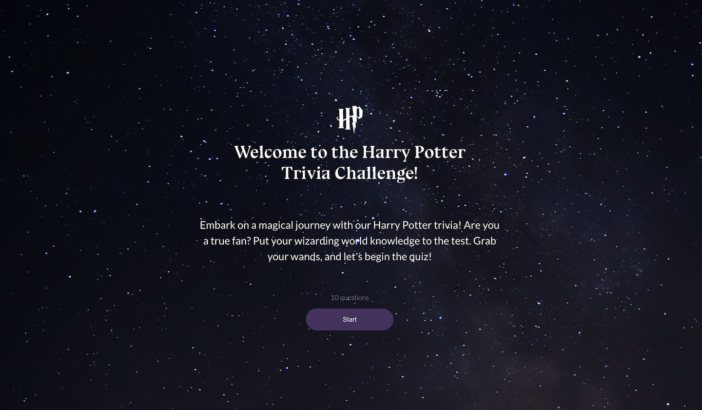

<h1 align="center">Welcome to Harry Potter Quiz App ⚡🤓🪄🦌</h1>

    
    
    
    
    
    
     
    

  

## Demo

_Pending_

## Features:

    - Quiz with 10 questions and 4 possible answers for each question
    - User can see his/her score at the end of the quiz
    - User can restart the quiz after finishing it
    - User recieves different message after finishing the quiz depending on the score

## Build with:

    - ReactJS
    - Redux
    - React Router DOM
    - JavaScript
    - CSS

## To do:

    - Add 3 quiz difficulty levels
    - Add more questions
    - Add more interactivity
    - Add mobile version
    - Save to local storage

## Contribute:

    If you would like to contribute and help building the quiz, please follow the steps below:

    1. Fork the repository
    2. Create your new branch: `git checkout -b feature/branch-name`
    3. Commit your changes: `git commit -am 'Describe your changes'`
    4. Push to the branch: `git push origin feature/branch-name`
    5. Submit a pull request

## Local Installation and Setup Instructions:

Clone down this repository and cd to `harry-potter-quiz`. You will need `node` and `npm` installed globally on your machine.

Installation:

`npm install`

To Run Test Suite:

`npm test`

To Start Server:

`npm start`

To Visit App:

`localhost:3000`

## Author

👤 **Elina Shelest**

- Twitter: [@elygills](https://twitter.com/elygills)
- Github: [@evengene](https://github.com/evengene)
- LinkedIn: [@elina-shelest](https://linkedin.com/in/elina-shelest)

## Show your support

Give a ⭐️ if this project helped you!
